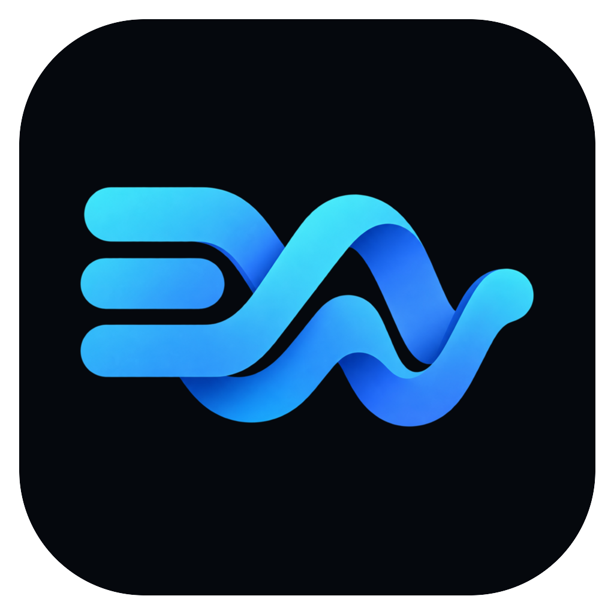
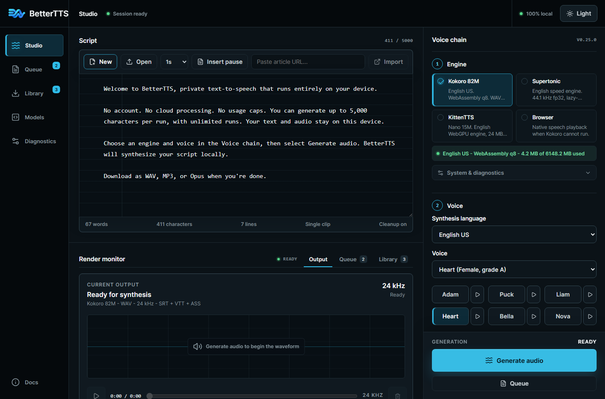
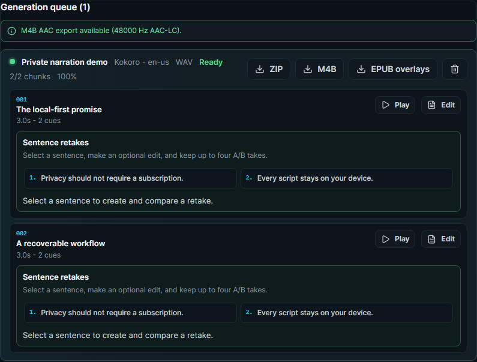
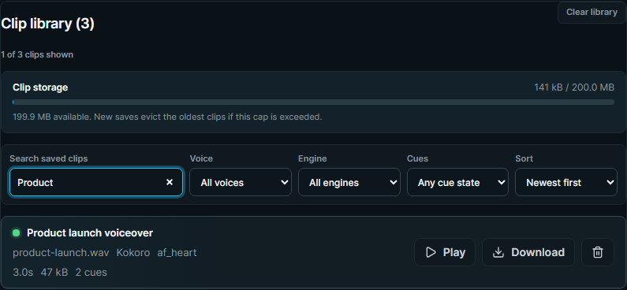
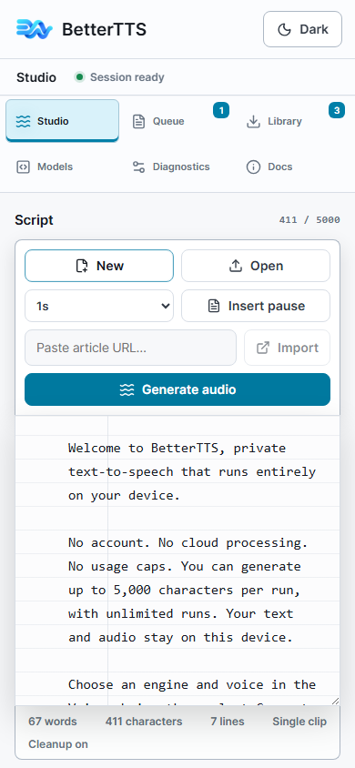

# BetterTTS

<p align="center">
  
</p>

<p align="center"><strong>Turn scripts, articles, and books into natural speech without sending your words away.</strong></p>

<p align="center">
  <a href="https://sysadmindoc.github.io/BetterTTS/"><strong>Open the web studio</strong></a>
  ·
  <a href="https://github.com/SysAdminDoc/BetterTTS/releases/latest"><strong>Get the Windows app</strong></a>
</p>

[](#)
[](LICENSE)
[](https://sysadmindoc.github.io/BetterTTS/)
[](#)
[](#)
[](#)



BetterTTS is a private speech-production workspace for short clips, narration, podcasts, and audiobooks. It runs neural voice engines in the browser or in the Windows desktop app. There is no account, cloud render queue, or metered character plan. Model files download only when you choose an engine, then stay on your device for reuse.

| What matters | What BetterTTS does |
|---|---|
| Your words stay yours | Scripts, imported documents, audio, diagnostics, and project files remain local. |
| Long jobs can recover | The persistent queue checkpoints work in IndexedDB and resumes after a tab or app closes. |
| Output is production-ready | Export WAV, MP3, Opus, FLAC, chaptered M4B, SRT, VTT, ASS, or EPUB3 Media Overlays. |
| You can inspect the evidence | Saved clips and exports carry engine, model, voice-source, cleanup, encoder, and quality provenance. |

<!-- BEGIN BETTERTTS CAPABILITIES -->
- **Application:** BetterTTS v0.25.0 · Web + Windows
- **Engines:** Kokoro local, Supertonic, KittenTTS, Chatterbox (experimental), Piper-plus, MeloTTS, Qwen3-TTS (experimental), Browser
- **Queue:** resumable jobs for Kokoro local, Supertonic, KittenTTS, Piper-plus, MeloTTS
- **Exports:** WAV, MP3, OPUS, FLAC, M4B audio · SRT, VTT, ASS captions
- **Tests:** 648 tests across 109 test files
- **Runtime licenses:** 21 direct package rows validated by `npm run license:runtime`
- **Model licenses:** Kokoro 82M (Apache-2.0); Sherpa Kokoro int8 pack (Apache-2.0); Supertonic ONNX model (OpenRAIL); KittenTTS model (Apache-2.0); Chatterbox ONNX models (MIT); Chatterbox multilingual ONNX model (MIT); Piper-plus Tsukuyomi-chan (MIT); Sherpa Piper Cori pack (Public-Domain); MeloTTS model (MIT); Sherpa MeloTTS pack (MIT); Qwen3-TTS model (Apache-2.0); Browser voices (Device-managed)
<!-- END BETTERTTS CAPABILITIES -->

## Pick the version that fits your work

### Web studio

Open [BetterTTS on GitHub Pages](https://sysadmindoc.github.io/BetterTTS/). The PWA works in current Chromium and Firefox releases. WebGPU provides the fastest browser path when the adapter is compatible, and WASM q8 is available as the conservative fallback. Install it from the browser if you want an app-like window and offline shell.

### Windows desktop app

Download the installer from the [latest release](https://github.com/SysAdminDoc/BetterTTS/releases/latest). The desktop edition adds native Sherpa-ONNX synthesis, local file projects, FFmpeg output, whisper.cpp caption alignment, a loopback-only OpenAI-compatible speech endpoint, and optional Qwen3-TTS or RVC sidecars.

The current Windows build is unsigned. Windows may show a SmartScreen warning. Every release includes SHA-256 checksums and a CycloneDX SBOM so you can verify the exact installer before running it.

### Browser companion

The optional MV3 extension sends selected text or the current page to BetterTTS. It requests temporary active-tab access and does not declare broad host permissions.

1. Download `bettertts-extension-v0.25.0.zip` from the latest release.
2. Extract it to a folder you plan to keep.
3. Open your browser's extensions page and enable Developer mode.
4. Choose **Load unpacked**, then select the extracted folder.

The ZIP is the supported self-hosted install path. Modern Chromium browsers reject ordinary self-signed CRX files unless an enterprise policy supplies the required trust path.

## See the workflow

| Resumable production queue | Searchable local library |
|---|---|
|  |  |

<p align="center">
  
</p>

## From text to finished audio

1. Paste a script, import a public article, or open TXT, EPUB, PDF, or DOCX.
2. Review the cleanup preview. Restore the raw import or undo any normalization rule you do not want.
3. Pick an engine, language, and voice. Preview voices before committing a long job.
4. Generate a clip immediately or send chapters to the resumable queue.
5. Review sentence cues and quality flags. Retake a sentence without rebuilding the whole chapter.
6. Export the audio, captions, chapter data, and provenance record you need.

## Engines

| Engine | Where it runs | Best fit |
|---|---|---|
| Kokoro 82M | WebGPU, WASM, or native Windows CPU | Natural general-purpose narration in eight languages |
| Supertonic | Browser | Fast English previews at 44.1 kHz |
| KittenTTS | Browser WebGPU | Lightweight English generation |
| Chatterbox | Browser, opt-in | Permission-gated reference-voice work with disclosed PerTh watermarking |
| Piper-plus | Browser, experimental | Multilingual voices with a permissive runtime path |
| MeloTTS | Windows | Native Chinese and English synthesis |
| Qwen3-TTS | Windows, optional sidecar | Style-directed multilingual speech |
| Browser voices | Browser or Windows shell | Immediate device-native fallback |

Kokoro includes 28 English voices plus Japanese, Mandarin Chinese, Spanish, French, Hindi, Italian, and Brazilian Portuguese voices. The desktop model manager downloads native packs into the user data directory only when requested. Each built-in pack is pinned to a reviewed source and verified before installation.

## Work made for long-form audio

- Import an EPUB and review chapter names, order, exclusions, voice assignments, and blends before queueing it.
- Keep queue progress across restarts. Pause, resume, repair a failed chunk, or regenerate one sentence.
- Read along in a chapter-aware view with click-to-seek paragraphs, sentence highlighting, and per-document resume.
- Export chaptered M4B, ZIP bundles, captions, or EPUB3 Media Overlays from the same project.
- Add a music bed, target audiobook or podcast loudness, adjust pitch without changing tempo, and keep the original for comparison.
- Re-voice timed subtitles while preserving silence gaps and warning when a cue cannot fit naturally.

## Privacy, consent, and recovery

BetterTTS has no telemetry endpoint and no account system. The web edition stores settings, models, queue records, and clips in browser-managed local storage. The desktop edition stores its projects and optional model packs under the current Windows profile.

Reference-voice features require an ownership or permission acknowledgement. Restricted weights can be registered as metadata, but BetterTTS does not copy or activate them automatically. Generated provenance distinguishes built-in voices, user-supplied sources, cloned sources, sidecars, and RVC post-processing.

Document import is bounded before extraction. PDF files containing JavaScript actions are rejected. Native model archives reject links, devices, and unexpected entries, then validate the staged tree and expected digest before activation. Support diagnostics omit script text, imported URLs, credentials, raw audio, and unredacted local paths.

If durable storage is blocked or full, the app says so. It keeps the in-memory session usable and tells you to export before closing instead of claiming the data was saved.

## Output and automation

| Output | Notes |
|---|---|
| WAV | Lossless master at the engine's native sample rate |
| MP3 | 96, 128, or 160 kbps |
| Opus/WebM | Compact browser-friendly delivery |
| FLAC | Windows desktop and CLI |
| M4B | AAC audiobook with chapters and optional cover art |
| SRT, VTT, ASS | Sentence or word timing, including karaoke-style ASS presets |
| EPUB3 Media Overlays | Synchronized XHTML, SMIL, audio, and active reading styles |

The Windows app also includes a headless CLI:

```powershell
bettertts synth .\book.epub --output .\book.m4b --voice Heart --captions vtt
```

An optional loopback-only `POST /v1/audio/speech` endpoint supports local integrations. It is off by default, uses a new bearer token every time it starts, and closes active work when stopped.

## Local development

Requirements: Node.js 24 or later, npm 11, and Windows 10 or 11 for desktop packaging.

```powershell
git clone https://github.com/SysAdminDoc/BetterTTS.git
cd BetterTTS
npm ci
npm run dev
```

Run the complete local checks:

```powershell
npm test
npm run lint
npm run build
npm run smoke
npm run license:runtime
npm run extension:build
```

Build and exercise the Windows edition:

```powershell
npm run desktop:smoke
npm run desktop:dist
```

Useful commands:

| Command | Purpose |
|---|---|
| `npm run capabilities:check` | Confirm generated capability facts, test totals, model provenance, and versions |
| `npm run compatibility:matrix` | Run the accepted dependency compatibility gates |
| `npm run sbom:check` | Verify the checked-in web SBOM inventory |
| `npm run security:runtime` | Reject known production dependency findings outside the reviewed exception policy |
| `npm run release:smoke` | Exercise the release identity and packaged desktop surface |
| `npm run deploy` | Publish a verified GitHub Pages build from a disposable worktree |

## Release verification

Each release publishes the Windows installer, update metadata, extension ZIP, CycloneDX SBOM, and a SHA-256 manifest. Compare a downloaded file before running it:

```powershell
Get-FileHash '.\BetterTTS Setup 0.25.0.exe' -Algorithm SHA256
```

Then compare the value with `BetterTTS-v0.25.0-SHA256SUMS.txt` from the same release. Release notes state whether Authenticode signing was available for that build.

## Runtime licenses

Application code is MIT. Models and runtime packages keep their own licenses. The generated [capability manifest](capabilities.json) records model sources, immutable revisions, available hashes, and usage notes.

| Direct runtime package | SPDX license |
|---|---|
| `@breezystack/lamejs` | LGPL-3.0 |
| `@huggingface/transformers` | Apache-2.0 |
| `@mozilla/readability` | Apache-2.0 |
| `@piper-plus/g2p` | MIT |
| `ephone` | GPL-3.0-or-later |
| `electron-updater` | MIT |
| `fflate` | MIT |
| `kitten-tts-webgpu` | MIT |
| `kokoro-js` | Apache-2.0 |
| `linkedom` | ISC |
| `lucide-react` | ISC |
| `onnxruntime-node` | MIT |
| `onnxruntime-web` | MIT |
| `pdfjs-dist` | Apache-2.0 |
| `piper-plus` | MIT |
| `phonemizer` | Apache-2.0 |
| `react` | MIT |
| `react-dom` | MIT |
| `signalsmith-stretch` | MIT |
| `sherpa-onnx-node` | Apache-2.0 |
| `sherpa-onnx-win-x64` | Apache-2.0 |

Run `npm run license:runtime` to compare this reviewed inventory with the installed package metadata.

## Contributing

Focused bug reports and pull requests are welcome. Include the browser or Windows version, the selected engine, the exact action, and a redacted diagnostics export when it helps reproduce the problem.

Before opening a pull request, run:

```powershell
npm test
npm run lint
npm run build
```

## License

BetterTTS application code is available under the [MIT License](LICENSE). See the capability manifest for model and runtime terms.
